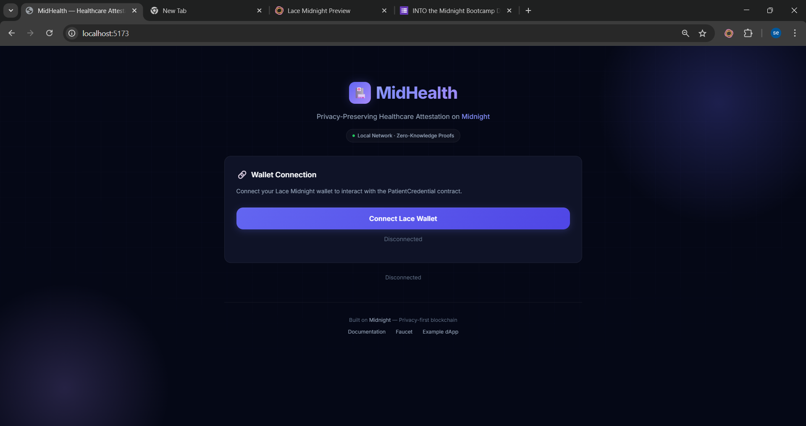
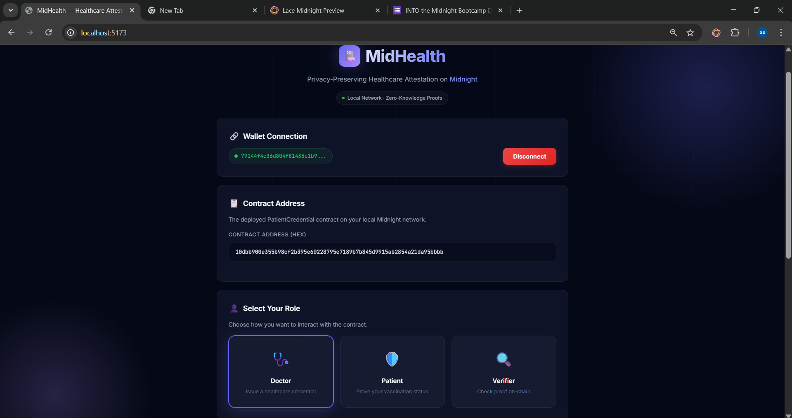
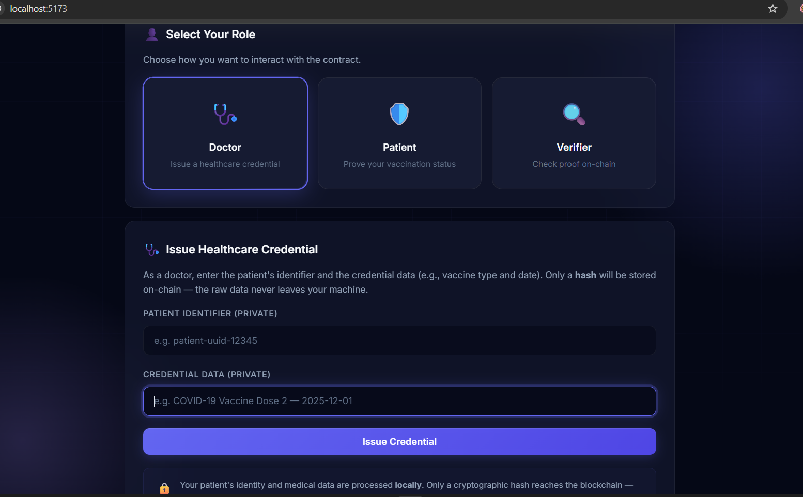
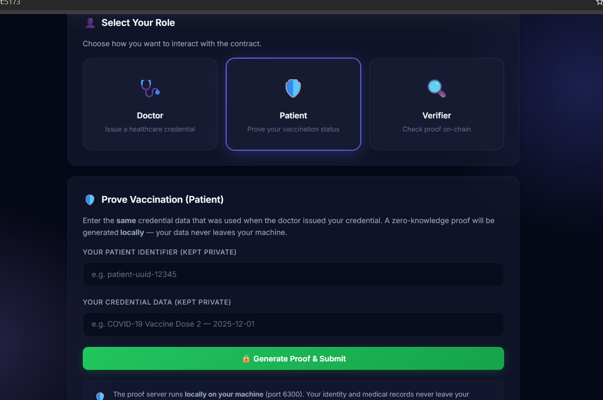
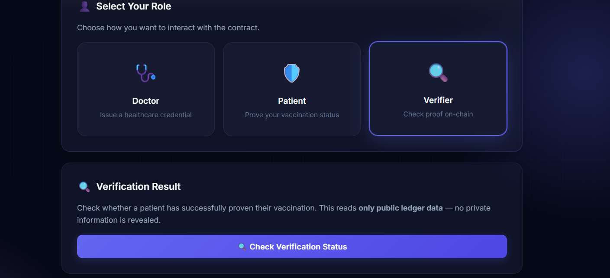

<div align="center">
  
#This project is built on the Midnight Network.
  
# 🏥 MidHealth

### Privacy-Preserving Healthcare Attestation on Midnight

[](https://midnight.network/)
[](LICENSE)
[](https://docs.midnight.network/develop/reference/compact/lang-ref)
[](https://reactjs.org/)
[](https://www.typescriptlang.org/)

<br />

**MidHealth** is a decentralized application that lets doctors issue healthcare credentials (e.g. vaccination records) and patients prove their status — all without revealing any private medical data. Built on Midnight's zero-knowledge blockchain, only cryptographic hashes and ZK proofs ever touch the chain. Your identity and medical records stay on your machine.

<br />

[Features](#-features) · [How It Works](#-how-it-works) · [Quick Start](#-quick-start) · [Architecture](#-architecture) · [Smart Contract](#-smart-contract) · [Tech Stack](#-tech-stack)

</div>

---

## 📋 Deployed Contract

| Field | Value |
|-------|-------|
| **Contract Address** | `10dbb900e355b98cf2b395e60228795e7189b7b845d9915ab2854a21da95bbbb` |
| **Network** | Midnight Local Standalone (`undeployed`) |
| **Compact Version** | `0.21` |
| **Contract Name** | `PatientCredential` |

---

## 🖼 Screenshots

<div align="center">

### Landing Page — Wallet Connection


<br /><br />

### Connected — Role Selection


<br /><br />

### Doctor — Issue Healthcare Credential


<br /><br />

### Patient — Generate Zero-Knowledge Proof


<br /><br />

### Verifier — On-Chain Verification Result


</div>

---

## ✨ Features

- **Zero-Knowledge Proofs** — Patients prove vaccination status without revealing identity or medical records
- **On-Chain Privacy** — Only cryptographic hashes are stored on the blockchain; raw data never leaves the user's machine
- **Three-Role System** — Doctor (Issuer), Patient (Prover), and Verifier each have distinct interactions
- **Credential Revocation** — Issuers can revoke credentials with ownership verification via ZK proof
- **Replay Protection** — Sequence-based key derivation prevents replay attacks
- **Glassmorphism UI** — Modern dark theme with animated gradients, glass cards, and framer-motion transitions
- **Lace Wallet Integration** — Native Midnight DApp Connector API (v4) with auto-connect timeout handling
- **Local Proof Generation** — ZK proofs are computed locally via Docker proof server (port 6300) — nothing leaves your machine
- **Monotonic Attestation Counter** — Every credential action increments an on-chain counter for auditability

---

## 🔄 How It Works

```
  👨‍⚕️ Doctor                    🧑 Patient                   🔍 Verifier
     │                            │                              │
     │ 1. Issue Credential        │                              │
     │    (private: patient ID,   │                              │
     │     vaccine data,          │                              │
     │     secret key)            │                              │
     │         │                  │                              │
     │    hash(pid + data + pk)   │                              │
     │    ──────────────────►     │                              │
     │    ONLY hash goes on-chain │                              │
     │                            │                              │
     │                            │ 2. Prove Vaccination         │
     │                            │    (private: same pid,       │
     │                            │     same vaccine data)       │
     │                            │         │                    │
     │                            │    ZK proof generated        │
     │                            │    locally (port 6300)       │
     │                            │    ──────────────────►       │
     │                            │    ONLY proof goes on-chain  │
     │                            │                              │
     │                            │                              │ 3. Check Result
     │                            │                              │    Reads public
     │                            │                              │    ledger state
     │                            │                              │         │
     │                            │                              │    ✅ VALID
     │                            │                              │    (never sees
     │                            │                              │     patient data)
```

### The Privacy Guarantee

| What the blockchain sees | What it NEVER sees |
|---|---|
| `hash(patientId + credentialData + issuerPubKey)` | Patient name / identity |
| Issuer's derived public key | Issuer's secret key |
| `VerificationResult.VALID` or `INVALID` | Raw medical/vaccine data |
| Attestation count | Any personally identifiable information |

---

## 🚀 Quick Start

### Prerequisites

| Tool | Version | Purpose |
|------|---------|---------|
| [Node.js](https://nodejs.org/) | ≥ 18 LTS | Runtime |
| [Docker](https://docs.docker.com/desktop/) | Latest | Proof server |
| [Lace Wallet](https://chromewebstore.google.com/detail/lace-midnight-preview/hgeekaiplokcnmakghbdfbgnlfheichg) | Latest | Wallet extension |
| [Compact Compiler](https://docs.midnight.network/develop/tutorial/building) | ≥ 0.20 | Contract compilation |

### 1. Clone & Install

```bash
git clone https://github.com/GangserX/MidHealth.git
cd MidHealth
npm install
```

### 2. Start Proof Server

```bash
docker pull midnightnetwork/proof-server:latest
docker run -p 6300:6300 midnightnetwork/proof-server \
  -- midnight-proof-server --network testnet
```

### 3. Compile Contract

```bash
cd contract
npm run compact    # Compile .compact → ZK circuits + TS bindings
npm run build
cd ..
```

### 4. Start the App

```bash
# Terminal 1 — Backend
cd backend && npm run build && node dist/server.js

# Terminal 2 — Frontend
cd frontend && npm run dev
```

Open **http://localhost:5173** in Chrome (with Lace wallet installed).

### 5. Connect Wallet & Test

1. Click **"Connect Lace Wallet"** → approve in the Lace popup
2. Select a role: **Doctor**, **Patient**, or **Verifier**
3. Follow the guided UI for each role

---

## 🏗 Architecture

```
┌──────────────────────────────────────────────────────────────────────┐
│                     FRONTEND  (React 18 + TypeScript + Vite)         │
│                                                                      │
│  ┌────────────────┐  ┌────────────────┐  ┌────────────────────────┐ │
│  │IssueCredential │  │  RequestProof  │  │     ProofResult        │ │
│  │  (Doctor)       │  │  (Patient)     │  │     (Verifier)         │ │
│  └───────┬────────┘  └───────┬────────┘  └──────────┬─────────────┘ │
│          └───────────────────┼──────────────────────┘               │
│                              │                                      │
│               ┌──────────────▼──────────────┐                      │
│               │  Lace Wallet Extension       │                      │
│               │  DApp Connector API v4       │                      │
│               │  window.midnight.mnLace      │                      │
│               └──────────────┬──────────────┘                      │
└──────────────────────────────┼──────────────────────────────────────┘
                               │
                ┌──────────────▼──────────────┐
                │  Local Proof Server          │
                │  Docker · port 6300          │
                │  Generates ZK proofs from    │
                │  private witness data        │
                └──────────────┬──────────────┘
                               │
                ┌──────────────▼──────────────┐
                │  Midnight Blockchain         │
                │  PatientCredential Contract  │
                │                              │
                │  PUBLIC:  credentialHash      │
                │           issuerPubKey        │
                │           credentialState     │
                │           lastVerification    │
                │           attestationCount    │
                │                              │
                │  PRIVATE: patient identity    │
                │           medical data        │
                │           issuer secret key   │
                └──────────────┬──────────────┘
                               │
                ┌──────────────▼──────────────┐
                │  Backend (Express)           │
                │  port 3001                   │
                │  Event indexing + API proxy  │
                └─────────────────────────────┘
```

---

## 📜 Smart Contract

The contract is written in **Compact** (Midnight's ZK smart contract language) and lives at [`contract/src/PatientCredential.compact`](contract/src/PatientCredential.compact).

### Exported Circuits

| Circuit | Called By | What It Does |
|---------|-----------|-------------|
| `issueCredential()` | Doctor | Hashes private patient data + issuer key → stores hash on-chain. Sets state to `ACTIVE`. |
| `proveVaccinated()` | Patient | Re-computes hash from private inputs → ZK-proves it matches on-chain hash. Sets `lastVerification = VALID`. |
| `revokeCredential()` | Doctor | Verifies issuer ownership via key derivation → marks credential `REVOKED`. |

### Public Ledger State

```
credentialState   : CredentialState    (EMPTY | ACTIVE | REVOKED)
credentialHash    : Bytes<32>          hash(patientId + payload + issuerPubKey)
issuerPubKey      : Bytes<32>          derived from issuer's secret key
attestationCount  : Counter            incremented on every operation
lastVerification  : VerificationResult (NONE | VALID | INVALID)
sequence          : Counter            replay protection
```

### Witness Functions (Private — Run Locally)

```
issuerSecretKey()    → Bytes<32>   Doctor's secret key (never on-chain)
patientSecretId()    → Bytes<32>   Patient's identifier (never on-chain)
credentialPayload()  → Bytes<32>   Medical data (never on-chain)
```

---

## 📁 Project Structure

```
MidHealth/
├── README.md
├── LICENSE                            # Apache 2.0
├── package.json                       # Monorepo workspace root
│
├── contract/                          # Compact smart contract
│   ├── package.json
│   ├── tsconfig.json
│   └── src/
│       └── PatientCredential.compact  # ZK attestation contract (183 lines)
│
├── frontend/                          # React + TypeScript + Vite
│   ├── package.json
│   ├── vite.config.ts
│   ├── index.html
│   └── src/
│       ├── App.tsx                    # Wallet connect + role selection
│       ├── main.tsx                   # Entry point
│       ├── config.ts                  # Network endpoints
│       ├── styles.css                 # Glassmorphism design system
│       ├── midnight.d.ts             # window.midnight type defs
│       └── components/
│           ├── IssueCredential.tsx    # Doctor → issue credential
│           ├── RequestProof.tsx       # Patient → generate ZK proof
│           └── ProofResult.tsx        # Verifier → read public state
│
├── backend/                           # Express API server
│   ├── package.json
│   ├── tsconfig.json
│   └── src/
│       └── server.ts                  # Event indexer + API proxy
│
├── scripts/
│   └── deploy.sh                      # Compile + deploy contract
│
├── tests/
│   ├── contract.test.ts               # Contract unit tests (34 passing)
│   └── verifier.test.ts              # Proof verification tests
│
└── examples/
    └── end-to-end-flow.md            # Step-by-step walkthrough
```

---

## 🛠 Tech Stack

| Layer | Technology |
|-------|-----------|
| **Blockchain** | [Midnight Network](https://midnight.network/) — ZK privacy blockchain (Cardano sidechain) |
| **Smart Contract** | [Compact](https://docs.midnight.network/develop/reference/compact/lang-ref) v0.21 — compiles to ZK circuits |
| **Frontend** | React 18 · TypeScript 5.9 · Vite 5 · Framer Motion 11 |
| **Backend** | Node.js · Express 4 · TypeScript |
| **Wallet** | [Lace Midnight Preview](https://chromewebstore.google.com/detail/lace-midnight-preview/hgeekaiplokcnmakghbdfbgnlfheichg) — DApp Connector API v4 |
| **Proof Server** | Docker container (`midnightnetwork/proof-server`) — local ZK proving |
| **Design** | Glassmorphism · CSS custom properties · Animated gradients · Inter + JetBrains Mono |
| **Testing** | 34/34 tests passing (contract + verifier) |

---

## 🔐 Security & Privacy

- **No raw patient data on-chain** — only `persistentHash` outputs
- **Witness functions run locally** — secret keys never leave the user's machine
- **Proof server is local** — Docker on `localhost:6300`, no third-party proving
- **Replay-safe key derivation** — sequence counter prevents replay attacks
- **No PII in logs** — backend and contract events contain no identifiers
- **Issuer-only revocation** — only the original doctor can revoke via ZK ownership proof

---

## 📚 Resources

| Resource | Link |
|----------|------|
| Midnight Docs | https://docs.midnight.network/ |
| Compact Language Reference | https://docs.midnight.network/develop/reference/compact/lang-ref |
| DApp Connector API | https://docs.midnight.network/develop/reference/midnight-api/dapp-connector |
| Proof Server Setup | https://docs.midnight.network/develop/tutorial/using/proof-server |
| Example Repos | https://docs.midnight.network/develop/tutorial/building/examples-repo |
| Midnight Discord | https://discord.com/invite/midnightnetwork |

---

## 📄 License

[Apache License 2.0](LICENSE)
